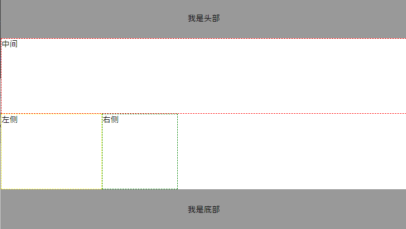

# 圣杯布局和双飞翼布局

```
圣杯布局和双飞翼布局是前端工程师需要日常掌握的重要布局方式  
两者的功能相同, 都是为了实现一个两侧宽度固定, 中间宽度自适应的三栏布局
```

## 异同

圣杯布局来自于[国外一篇文章](https://alistapart.com/article/holygrail), 双飞翼布局来自国内淘宝

两者实现方法略有差异, 但是都遵循以下要点:
+ 效果相同, 但是在实现中间列自适应方法和左右两侧位置布局上不同
+ 两侧宽度固定, 中间宽度自适应
+ 中间部分在DOM结构上优先, 优先渲染
+ 允许三列中的任意一列成为最高列(其它两列自适应)
+ 只需要使用一个额外的`<div>`标签

## 圣杯布局

1. 结构

```html
<div class="header">我是头部</div>
<div class="container">
  <div class="center">中间</div>
  <div class="left">左侧</div>
  <div class="right">右侧</div>
</div>
<div class="footer">我是底部</div>
```

基本结构如上, 需要注意的是`.center`需要在`.container`的第一个子元素(优先渲染)

2. css

假设左右两列宽度固定分别为 200px, 150px, `container`的css样式为:

```css
.container {
  padding-left: 200px;
  padding-right: 150px;
}
```

预留出相应空间:


然后分别设置`center`, `left`, `right`块的宽, 主要`center`因为要自适应所以得为`100%`

```css
.container .center {
  float: left;
  border: 1px dashed red;
  height: 150px;
  width: 100%;
}

.container .left {
  float: left;
  border: 1px dashed green;
  width: 200px;
  height: 150px;
}

.container .right {
  float: left;
  border: 1px dashed burlywood;
  width: 150px;
  height: 150px;
}
```

效果如下:


因为 center 宽度占满了一行, 所以后面的被挤到下一行, 现在要做的就是把, 左右两个div想办法移动到正确的位置

现将`left`利用负外边距向左移动`-100%`, 这样就和`center`同一起跑线上了:

```css
.container .left {
  float: left;
  border: 1px dashed green;
  width: 200px;
  height: 150px;
  margin-left: -100%;
}
```

就会和`center`发生重叠


然后就再使用`position:relative`让`left`左移到正确位置

```css
.left{
  position: relative;
  left: -200px;
}
```

同理, `right`也一样先用负边距左移, 然后利用position`右移`, 注意这里的负边距为本身的宽度, 因为不用移到到和center同一"起跑线"

```css
.right {
  margin-left: -150px;
  position: relative
  left: 150px;
}
```

这样, 大家都到了正确位置, 中间也可以自适应了, 至此, 布局效果完成.   


不过还需要考虑最后一步, 那就是页面的最小宽度:  

要想保证该布局效果正常显示, 由于两侧都具有固定的宽度, 所以需要给定页面一个最小的宽度, 但这并不只是简单的200+150=350px. 回想之前`left`使用了`position: relative`, 所以就意味着在`center开始`的区域, 还存在着一个left的宽度. 所以页面的最小宽度应该设置为`200+150+200=550px`


## 双飞翼布局

1. 结构

```html
<body>
  <div class="header">我是头部</div>
  <div class="container">
    <div class="center">中间</div>
  </div>
  <div class="left">左侧</div>
  <div class="right">右侧</div>
  <div class="footer">我是底部</div>

  
</body>
```

基本结构和`圣杯`差不多, 只是在`container`包裹的内容不同, 也肯定导致左右两侧样式与圣杯也有所差异

2. css

还是按照圣杯的思路, 浮动`container`, `left`, `right`, 注意是`container`, `center`没有设置浮动, 然后`footer`再清除浮动:

```css
.container {
  float: left;
  border: 1px dashed red;
  height: 150px;
  width: 100%;
}

.left {
  float: left;
  border: 1px dashed yellow;
  height: 150px;
  width: 200px;
}

.right {
  float: left;
  border: 1px dashed green;
  height: 150px;
  width: 150px;
}

.footer {
  clear: both;
  background-color: #999;
  height: 80px;
  text-align: center;
  line-height: 80px;
}
```

和圣杯一样left 和 right 都被挤下去了:



这个时候就需要为left和right像圣杯一样预留空间了:

```css
.center {
  padding-left: 200px;
  padding-right: 150px;
}
```

然后只需要通过`负边距`移动到正确位置就行, 不需要`relative`了, 因为 container 和 left 和 right 的父容器没有设置`padding`值

最后计算最小页面宽度:

由于双飞翼布局没有用到`position:relative`进行定位, 所以最小页面宽度应该为200+150=350px.

但是当页面宽度缩小到350px附近时, 会挤占中间栏的宽度, 使得其内容被右侧栏覆盖

最终完成与圣杯一样的效果

## 圣杯完整代码
```css
* {margin: 0;padding: 0;box-sizing: border-box;}
.header {
  background-color: #999;
  height: 80px;
  text-align: center;
  line-height: 80px;
}

.container {
  padding-left: 200px;
  padding-right: 150px;
}

.container .center {
  float: left;
  border: 1px dashed red;
  height: 150px;
  width: 100%;
}

.container .left {
  float: left;
  border: 1px dashed green;
  width: 200px;
  height: 150px;
  margin-left: -100%;
  position: relative;
  left: -200px;
}

.container .right {
  float: left;
  border: 1px dashed burlywood;
  width: 150px;
  height: 150px;
  margin-left: -150px;
  position: relative;
  left: 150px;
}

.footer {
  clear: both;
  background-color: #999;
  height: 80px;
  text-align: center;
  line-height: 80px;
}
```

```html
<body>
  <div class="header">我是头部</div>
  <div class="container">
    <div class="center">中间</div>
    <div class="left">左侧</div>
    <div class="right">右侧</div>
  </div>
  <div class="footer">我是底部</div>
</body>
```


## 双飞翼完整代码

```css
* {
  margin: 0;
  padding: 0;
  box-sizing: border-box;
}

.header {
  background-color: #999;
  height: 80px;
  text-align: center;
  line-height: 80px;
}

.container {
  float: left;
  border: 1px dashed red;
  height: 150px;
  width: 100%;
}

.center {
  padding-left: 200px;
  padding-right: 150px;
}

.left {
  float: left;
  border: 1px dashed yellow;
  height: 150px;
  width: 200px;
  position: relative;
  margin-left: -100%;
}

.right {
  float: left;
  border: 1px dashed green;
  height: 150px;
  width: 150px;
  position: relative;
  margin-left: -150px;
}

.footer {
  clear: both;
  background-color: #999;
  height: 80px;
  text-align: center;
  line-height: 80px;
}
```

```html
<body>
  <div class="header">我是头部</div>
  <div class="container">
    <div class="center">中间</div>
  </div>
  <div class="left">左侧</div>
  <div class="right">右侧</div>
  <div class="footer">我是底部</div>
</body>
```

本文参考:[https://www.jianshu.com/p/81ef7e7094e8](https://www.jianshu.com/p/81ef7e7094e8)


图片添加版:

# 圣杯布局和双飞翼布局

```
圣杯布局和双飞翼布局是前端工程师需要日常掌握的重要布局方式  
两者的功能相同, 都是为了实现一个两侧宽度固定, 中间宽度自适应的三栏布局
```

## 异同

圣杯布局来自于[国外一篇文章](https://alistapart.com/article/holygrail), 双飞翼布局来自国内淘宝

两者实现方法略有差异, 但是都遵循以下要点:
+ 效果相同, 但是在实现中间列自适应方法和左右两侧位置布局上不同
+ 两侧宽度固定, 中间宽度自适应
+ 中间部分在DOM结构上优先, 优先渲染
+ 允许三列中的任意一列成为最高列(其它两列自适应)
+ 只需要使用一个额外的`<div>`标签

## 圣杯布局

1. 结构

```html
<div class="header">我是头部</div>
<div class="container">
  <div class="center">中间</div>
  <div class="left">左侧</div>
  <div class="right">右侧</div>
</div>
<div class="footer">我是底部</div>
```

基本结构如上, 需要注意的是`.center`需要在`.container`的第一个子元素(优先渲染)

2. css

假设左右两列宽度固定分别为 200px, 150px, `container`的css样式为:

```css
.container {
  padding-left: 200px;
  padding-right: 150px;
}
```

预留出相应空间:


然后分别设置`center`, `left`, `right`块的宽, 主要`center`因为要自适应所以得为`100%`

```css
.container .center {
  float: left;
  border: 1px dashed red;
  height: 150px;
  width: 100%;
}

.container .left {
  float: left;
  border: 1px dashed green;
  width: 200px;
  height: 150px;
}

.container .right {
  float: left;
  border: 1px dashed burlywood;
  width: 150px;
  height: 150px;
}
```

效果如下:


因为 center 宽度占满了一行, 所以后面的被挤到下一行, 现在要做的就是把, 左右两个div想办法移动到正确的位置

现将`left`利用负外边距向左移动`-100%`, 这样就和`center`同一起跑线上了:

```css
.container .left {
  float: left;
  border: 1px dashed green;
  width: 200px;
  height: 150px;
  margin-left: -100%;
}
```

就会和`center`发生重叠


然后就再使用`position:relative`让`left`左移到正确位置

```css
.left{
  position: relative;
  left: -200px;
}
```

同理, `right`也一样先用负边距左移, 然后利用position`右移`, 注意这里的负边距为本身的宽度, 因为不用移到到和center同一"起跑线"

```css
.right {
  margin-left: -150px;
  position: relative
  left: 150px;
}
```

这样, 大家都到了正确位置, 中间也可以自适应了, 至此, 布局效果完成.   


不过还需要考虑最后一步, 那就是页面的最小宽度:  

要想保证该布局效果正常显示, 由于两侧都具有固定的宽度, 所以需要给定页面一个最小的宽度, 但这并不只是简单的200+150=350px. 回想之前`left`使用了`position: relative`, 所以就意味着在`center开始`的区域, 还存在着一个left的宽度. 所以页面的最小宽度应该设置为`200+150+200=550px`


## 双飞翼布局

1. 结构

```html
<body>
  <div class="header">我是头部</div>
  <div class="container">
    <div class="center">中间</div>
  </div>
  <div class="left">左侧</div>
  <div class="right">右侧</div>
  <div class="footer">我是底部</div>

  
</body>
```

基本结构和`圣杯`差不多, 只是在`container`包裹的内容不同, 也肯定导致左右两侧样式与圣杯也有所差异

2. css

还是按照圣杯的思路, 浮动`container`, `left`, `right`, 注意是`container`, `center`没有设置浮动, 然后`footer`再清除浮动:

```css
.container {
  float: left;
  border: 1px dashed red;
  height: 150px;
  width: 100%;
}

.left {
  float: left;
  border: 1px dashed yellow;
  height: 150px;
  width: 200px;
}

.right {
  float: left;
  border: 1px dashed green;
  height: 150px;
  width: 150px;
}

.footer {
  clear: both;
  background-color: #999;
  height: 80px;
  text-align: center;
  line-height: 80px;
}
```

和圣杯一样left 和 right 都被挤下去了:


这个时候就需要为left和right像圣杯一样预留空间了:

```css
.center {
  padding-left: 200px;
  padding-right: 150px;
}
```

然后只需要通过`负边距`移动到正确位置就行, 不需要`relative`了, 因为 container 和 left 和 right 的父容器没有设置`padding`值

最后计算最小页面宽度:

由于双飞翼布局没有用到`position:relative`进行定位, 所以最小页面宽度应该为200+150=350px.

但是当页面宽度缩小到350px附近时, 会挤占中间栏的宽度, 使得其内容被右侧栏覆盖

最终完成与圣杯一样的效果

## 圣杯完整代码
```css
* {margin: 0;padding: 0;box-sizing: border-box;}
.header {
  background-color: #999;
  height: 80px;
  text-align: center;
  line-height: 80px;
}

.container {
  padding-left: 200px;
  padding-right: 150px;
}

.container .center {
  float: left;
  border: 1px dashed red;
  height: 150px;
  width: 100%;
}

.container .left {
  float: left;
  border: 1px dashed green;
  width: 200px;
  height: 150px;
  margin-left: -100%;
  position: relative;
  left: -200px;
}

.container .right {
  float: left;
  border: 1px dashed burlywood;
  width: 150px;
  height: 150px;
  margin-left: -150px;
  position: relative;
  left: 150px;
}

.footer {
  clear: both;
  background-color: #999;
  height: 80px;
  text-align: center;
  line-height: 80px;
}
```

```html
<body>
  <div class="header">我是头部</div>
  <div class="container">
    <div class="center">中间</div>
    <div class="left">左侧</div>
    <div class="right">右侧</div>
  </div>
  <div class="footer">我是底部</div>
</body>
```


## 双飞翼完整代码

```css
* {
  margin: 0;
  padding: 0;
  box-sizing: border-box;
}

.header {
  background-color: #999;
  height: 80px;
  text-align: center;
  line-height: 80px;
}

.container {
  float: left;
  border: 1px dashed red;
  height: 150px;
  width: 100%;
}

.center {
  padding-left: 200px;
  padding-right: 150px;
}

.left {
  float: left;
  border: 1px dashed yellow;
  height: 150px;
  width: 200px;
  position: relative;
  margin-left: -100%;
}

.right {
  float: left;
  border: 1px dashed green;
  height: 150px;
  width: 150px;
  position: relative;
  margin-left: -150px;
}

.footer {
  clear: both;
  background-color: #999;
  height: 80px;
  text-align: center;
  line-height: 80px;
}
```

```html
<body>
  <div class="header">我是头部</div>
  <div class="container">
    <div class="center">中间</div>
  </div>
  <div class="left">左侧</div>
  <div class="right">右侧</div>
  <div class="footer">我是底部</div>
</body>
```

本文参考:[https://www.jianshu.com/p/81ef7e7094e8](https://www.jianshu.com/p/81ef7e7094e8)

